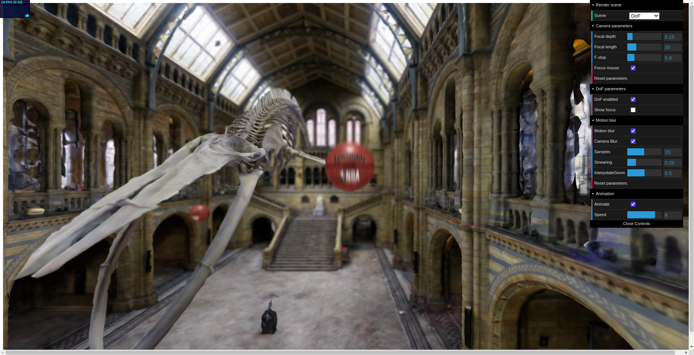

# Depth-of-field

## Table of Contents

* [Live Demo](#live-demo)
* [About the Project](#about-the-project)
  * [Built With](#built-with)
* [Installation](#installation)
* [Usage](#usage)
* [Authors](#authors)
* [Credits](#credits)
* [Acknowledgments](#acknowledgments)

## Live Demo
Live Demo available at https://lorenzoagnolucci.github.io/public/

The loading of the scene may require some time.

## About The Project


In this work we implement Depth of Field and Motion Blur as postprocessing effects using Three.js.

More details about the project in the [presentation](presentation.pdf)

### Built With

* [Webpack](https://webpack.js.org/)
* [Three.js](https://threejs.org/)

## Installation

To get a local copy up and running follow these simple steps:

1. Clone the repo
```sh
git clone https://github.com/LorenzoAgnolucci/Depth-of-field.git
```
2. Run ```npm install``` in the root folder of the repo


## Usage

Just run ```npm start``` to start the webserver and navigate to http://localhost:8080

## Authors

* [**Lorenzo Agnolucci**](https://github.com/LorenzoAgnolucci)
* [**Federico Nocentini**](https://github.com/FedeNoce)

## Credits
3D models used:
* [Hintze Hall, NHM London](https://sketchfab.com/3d-models/hintze-hall-nhm-london-surface-model-b2f3e84112d04bf1844e7ac2c4423566)
* [Spalding NBA Basketball](https://sketchfab.com/3d-models/spalding-basket-ball-db5f9c28708142909b15212625a127f9)


## Acknowledgments
Computer Graphics and 3D © Course held by Professor [Stefano Berretti](https://scholar.google.com/citations?user=3GPTAGQAAAAJ) - Computer Engineering Master Degree @[University of Florence](https://www.unifi.it/changelang-eng.html)
